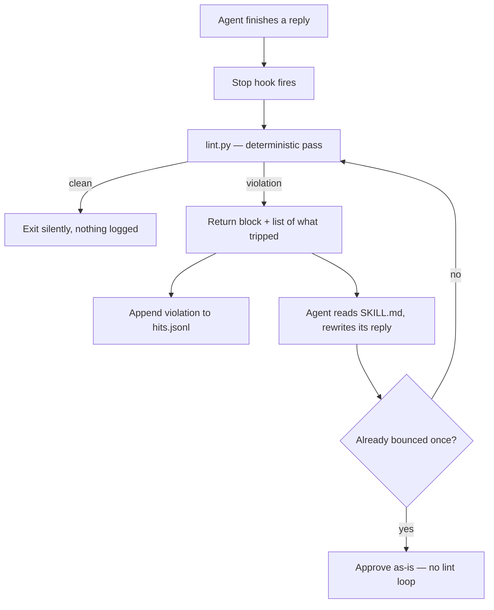

<div align="center"><pre>
███████╗██████╗ ███████╗ █████╗ ██╗  ██╗
██╔════╝██╔══██╗██╔════╝██╔══██╗██║ ██╔╝
███████╗██████╔╝█████╗  ███████║█████╔╝ 
╚════██║██╔═══╝ ██╔══╝  ██╔══██║██╔═██╗ 
███████║██║     ███████╗██║  ██║██║  ██╗
╚══════╝╚═╝     ╚══════╝╚═╝  ╚═╝╚═╝  ╚═╝
</pre></div>

<p align="center"><strong>An output parser for agent replies. Pick how your coding agent sounds once, and it keeps sounding that way.</strong></p>

<p align="center">
<a href="LICENSE"></a>
= 18">
<a href="https://github.com/ndisisnd/speakingwords/commits/main"></a>
<a href="https://github.com/ndisisnd/speakingwords/stargazers"></a>
</p>

<p align="center">
<a href="#install">Install</a> ·
<a href="#the-two-decisions">Decisions</a> ·
<a href="#how-enforcement-works">How it works</a> ·
<a href="#commands">Commands</a> ·
<a href="#faq">FAQ</a> ·
<a href="llms.txt">llms.txt</a>
</p>

<p align="center"><sub>
<b>AI agents / LLMs:</b> read <a href="llms.txt"><code>llms.txt</code></a>.
</sub></p>

---

You pick how your agent should sound, once, and it keeps sounding that way — without you
restating it every session.

Agent output drifts. It leans on stock vocabulary ("Landed", "Sweep", "Great point"), it
narrates instead of answering, and it slides back to its default voice no matter how many
times you ask for something terse. That is a configuration problem being solved as a
conversation problem. `speakingwords` turns the preference into installed configuration.

Works with **Claude Code** and **OpenAI Codex CLI**.

---

## Install

Requires **Node.js >= 18** and **Python 3** (the linter is Python; the CLI is Node).

**npm**

```sh
npm i -g speakingwords
```

**cURL** — for people who do not want a global npm install

```sh
curl -fsSL https://raw.githubusercontent.com/ndisisnd/speakingwords/main/install.sh | sh
```

Both paths install the same files. The cURL script downloads the published npm tarball,
verifies its SHA-256, unpacks it to `~/.speakingwords/app`, and symlinks `speakingwords`
into `~/.local/bin` (telling you if that is not on your PATH). It **refuses to install
without a checksum** unless you pass `--insecure`. Remove it again with
`sh install.sh --uninstall`.

Then:

```sh
speakingwords init
```

To verify it worked:

```sh
speakingwords version     # prints the installed version
speakingwords status      # shows what the linter has caught (hook mode)
```

---

## The decisions

`init` asks five questions — mode, agent + scope, voice, conciseness, register — and then
prints exactly what it wrote and where. `speakingwords init --defaults` takes every
default and asks nothing.

### Mode: how hard the rules are enforced

| Mode | Mechanism | Reliability | Footprint |
|------|-----------|-------------|-----------|
| **memory** | Writes up to 9 point-form rule lines into your agent's memory file | Lower — suggestive; the agent can still drift | Plain instruction lines. No scripts, no hooks. |
| **hook** | Installs a Stop hook that lints every finished reply and bounces violations | Higher — checked on every reply | A hook entry, the linter, the lexicon, a telemetry log |
| **both** | Writes the block *and* wires the Stop hook | Highest — prevention that is always in context, enforcement on every reply | Both of the above, minus the SessionStart injector |

Memory mode is honest about what it is: a suggestion the agent may ignore. Hook mode is
the one that actually holds.

#### Both: the block prevents, the hook enforces

At `both` the two layers divide the work, and the division is total.

- **The block prevents.** It is written exactly as memory mode writes it, so the rules are
  in context every session, unconditionally.
- **The Stop hook enforces.** It is wired exactly as hook mode wires it, so a reply that
  drifts anyway is still bounced.
- **No SessionStart injector is installed.** This is the point of the mode, not an
  omission. The injector states the same rules the block already states, so wiring both
  would put the contract in front of the model twice — tokens spent to teach nothing new.

That also closes a gap hook mode has. A resumed Codex thread fires no `SessionStart`
(openai/codex#24228), so hook mode's prevention is silently absent in that session. A
block in `CLAUDE.md` or `AGENTS.md` is there either way.

`unhook` on a both install is a downgrade, not a teardown: the hook comes out, the block
stays, and `pref.json` says `memory`. Re-running `init --both` puts the hook back.

### Voice: what the output looks like

| Voice | Shape |
|-------|-------|
| **terse** | Point form only. Bullets, short lists, tables, code. Brevity wins every trade-off. |
| **convo** | Prose is retained. Point form is allowed, but brevity is not forced. |

### Conciseness: how much of it survives

Voice says what shape a reply takes. Conciseness says how much of it there is. The two are
independent axes — any voice pairs with any level.

| Level | Target cut vs. an unstyled reply | Character |
|-------|----------------------------------|-----------|
| **low** | 10–20% | Prose intact; only decoration goes — filler, restatement, hedge stacks. |
| **high** | 25–35% | Every sentence earns its place. Explanations kept, elaborations cut. |

The percentages are targets measured across a fixture set, not rules applied to a single
reply: nothing can measure one reply against the reply you would otherwise have written.
Two guardrails hold at every level. Losing a fact is always worse than the violation it
was meant to fix, and `high` never collapses a convo reply into point form.

Two positions ship because two are what the recorded run proved. The dial carried a third,
`med`, during development; the recording measured `low` and `med` inside their bands and
found the old 40–50% `high` undercutting its own floor, so `med`'s behaviour and band were
promoted to become `high` and the old band was dropped. `med` is still accepted everywhere
a level is read — flag, `pref.json`, lexicon cell — and reads as `high`. Nothing that
already says `med` breaks.

Upgrading from 0.1.0 keeps the behaviour you already had: a `pref.json` with no
`conciseness` key reads as `high`, the most aggressive shipped level, which is the band
0.1.0 already behaved in. New installs are offered `high`.

Both voices obey the same language rules. Switching voice changes the *shape* of a reply,
never the standard of the language.

### Register: how the sentences are built

Voice says what shape a reply takes. Conciseness says how much of it there is. Register
says how the sentences themselves are built. Three independent axes — any voice pairs with
any level and any register.

| Register | Character |
|----------|-----------|
| **slack** | Colleague in a DM. Short sentences, everyday words, contractions where they read naturally. |
| **ste** | STE-inspired. Maximum 25 words a sentence, no contractions, active voice, imperative instructions, articles kept. |

`ste` is for procedures, runbooks and operator-facing docs — especially for readers whose
first language is not English. Two rules are enforced by the linter: `ste-contraction`
bounces "don't" and leaves "the pump's seal" alone, and `ste-long-sentence` bounces any
sentence over 25 words. The rest — active voice, one instruction a sentence, keeping the
articles — is stated in the contract the model reads, because a passive-voice regex is a
false-positive machine and a false positive bounces a good reply.

**STE-inspired, not STE-conformant.** ASD-STE100 is the aerospace industry's controlled
English standard. Its writing rules are implementable and that is what ships here. Its
approved-word dictionary is ASD's copyright: it is **not** shipped, reproduced or
approximated anywhere in this repository, and output from this register is not certified
STE. The specification is free to download from the issuing body at
[asd-ste100.org](https://asd-ste100.org/). Read it there.

The cap is 25 words flat. The real standard uses 20 words for procedures and 25 for
descriptions; nothing here can tell a procedure from a description, so the looser number
applies to both.

Upgrading from 0.2.0 or earlier keeps the behaviour you already had: a `pref.json` with no
`register` key reads as `slack`, which is what every install before 0.3.0 behaved as.

### Scope

`local` writes to the current project; `global` writes to your home config, so it applies
everywhere.

| | Claude Code | Codex CLI |
|---|---|---|
| Memory target, local | `CLAUDE.local.md` in the project | `AGENTS.md` in the project |
| Memory target, global | `~/.claude/CLAUDE.md` | `~/.codex/AGENTS.md` |
| Hook wiring, local | `.claude/settings.json` | `.codex/hooks.json` |
| Hook wiring, global | `~/.claude/settings.json` | `~/.codex/hooks.json` |
| Installed skill root | `~/.claude/skills/speakingwords/` | `~/.codex/speakingwords/` |

Installing for **both** agents ships one shared core at the Claude Code root and points the
Codex wiring at it — one lexicon, one linter, one log. Tuning the rules once changes
behaviour on both.

---

## How enforcement works

A rendered reply cannot be silently rewritten after the fact, so hook mode does not try.
It **lints and bounces**:



1. The agent finishes a reply. The **Stop hook** fires.
2. `lint.py` runs the **deterministic pass**: every strip rule (a regex from the lexicon)
   against the reply text, plus a structural check in terse voice that flags paragraph-form
   answers. Code blocks are excluded from the structural check.
3. **Clean** → the hook exits silently. Nothing is shown, nothing is logged.
4. **Violation** → the hook returns `{"decision": "block", "reason": ...}` with the list of
   what tripped. The agent then does the **probabilistic pass**: it reads `SKILL.md` and
   rewrites its own reply against the voice contract.
5. Every violation on a bounce is appended to `hits.jsonl` — the data `status` reads.

Two guarantees matter more than the catching:

- **One bounce maximum.** The hook reads the host's `stop_hook_active` flag. A reply that
  has already been bounced once is approved whatever it says. There is no lint loop.
- **Fail-open, always.** Malformed input, a missing transcript, an unreadable lexicon, a bug
  in the linter — every one of them approves the reply, and the hook always exits 0. The
  worst thing a broken install can do is let a bad reply through. It can never eat a good
  reply or wedge your session.

A false positive is the worst failure class here, so the shipped rules are anchored
narrowly: `Landed` only at the start of a line ("the plane landed safely" is fine),
`Certainly` only with punctuation after it ("certainly true" is fine), `elevate` but never
"elevator".

### Prevention: the SessionStart injector

Bouncing a reply costs a full regeneration, so the cheapest bounce is the one that never
happens. Alongside the Stop hook, hook mode installs a **SessionStart hook** that states
your voice and conciseness rules once, near the top of each session's context — roughly
200–400 tokens, injected once rather than per prompt.

It is prevention, never enforcement. It cannot block a reply, and if it fails, times out or
is masked, nothing about your session changes: the Stop hook is still the thing that holds
the line. Both agents get it, from the same script.

### Codex specifics

- **Trust.** Codex will not run a hook until you grant it trust, once. The installer says so
  explicitly. Until you do, Codex replies pass unlinted.
- **Codex below v0.124.0 is audit-only.** The stable hooks engine starts at v0.124.0. On
  anything older there is no Stop hook to wire, so the installer uses the `notify`
  (`agent-turn-complete`) fallback instead: replies are linted *after* the turn is already
  delivered, and violations are logged for `status`, but **nothing is blocked or rewritten**.
  The install summary states this plainly rather than burying it. Upgrade Codex and re-run
  `init` to get real enforcement.
- **A resumed Codex thread gets no injected block.** On Codex 0.130.0, launching bare
  `codex` auto-restores your previous thread without emitting `SessionStart`
  ([openai/codex#24228](https://github.com/openai/codex/issues/24228)), so the style block
  is not injected for that session. Nothing else changes — the Stop hook still lints and
  bounces exactly as it would have. Starting a fresh session injects normally.
- The `notify` key is user-level only in Codex — there is no per-project equivalent — so the
  audit pass applies everywhere even if you chose `local`. If some other tool already owns
  `notify`, the installer refuses rather than overwriting it.

---

## Commands

```
speakingwords init [flags]     install a style contract
speakingwords version          print the installed version
speakingwords status           show what the linter caught (hook mode)
speakingwords update "<hint>"  tune the rules from one line of English
speakingwords unhook [--yes]   remove hook wiring (alias: unset)
```

### init

```sh
speakingwords init                                  # asks five questions
speakingwords init --defaults                       # takes every default, asks nothing
speakingwords init --hook --agent claude --scope global --voice terse --conciseness high
```

| Flag | Values |
|------|--------|
| `--memory` / `--hook` / `--both` | mode |
| `--agent` | `claude` · `codex` · `both` |
| `--scope` | `local` · `global` |
| `--voice` | `terse` · `convo` |
| `--conciseness` | `low` · `high` (legacy `med` reads as `high`) |
| `--register` | `slack` · `ste` |
| `--defaults` | take every default and ask nothing |

Passing them all skips every question, which is what makes it scriptable. A command line
that already answers mode, agent, scope and voice is treated as a script and takes the
default level and default register rather than being asked a brand-new question, so 0.1.0
and 0.2.0 install scripts keep working untouched. `--defaults` does the same thing on
purpose rather than by inference, and any flag passed alongside it still wins. Re-running
`init` replaces the memory block in place rather than adding a second one.

### status

Aggregates `hits.jsonl` into a table: rule, how often it fired, one real example of what
tripped it, when it last fired.

Under memory mode it prints one line explaining there is nothing to count — memory mode
installs no hook, so there is no telemetry — and exits 0. A half-written log line from a
killed process is skipped and counted, never thrown.

Under both mode it reports the layers first: whether the block is still in each memory
file, whether the Stop hook is still wired, and that no SessionStart injector is installed.
Then the same hit table as hook mode.

### update

Tune the rules from plain English. Say what you want **less** of or **more** of:

```sh
speakingwords update "less emoji"
speakingwords update "no game-changer, stop saying dive into"
speakingwords update "more robust"          # allow a word again
speakingwords update "more concise"         # move the conciseness level up
speakingwords update "simplified technical english"   # switch to the ste register
speakingwords update "back to slack register"         # and switch back
```

`less X` · `no X` · `stop saying X` · `ban X` · `avoid X` → adds a strip rule.
`more X` · `allow X` · `unban X` · `stop flagging X` → removes one.

Edits land in the installed `refs/lexicon.md`, which is the file the linter actually reads,
so a new rule is live on the very next reply — no reinstall. Every touched file gets a
`.bak` beside it first; **if the backup cannot be written, nothing is edited.** Where a
memory block is installed — memory mode and both mode — it is re-rendered in the same pass,
so the two never disagree.

### unhook (alias: unset)

Removes the hook wiring for every agent in your install: the Claude Code `settings.json`
entry, the Codex `hooks.json` entry, and the Codex `config.toml` notify line. It tells you
exactly which files it will touch *before* touching them, and a bare Enter means no.
`--yes` skips the question, not the report.

What stays: `hits.jsonl` and the installed skill files. Your record of what was caught is
yours; turning enforcement off is not deleting your history.

On a both-mode install it is a downgrade rather than a removal: the hook comes out, the
memory block stays untouched, and `pref.json` drops to `memory`. You are left with a
working memory install, and `init --both` restores the hook.

After removing, it greps every file it touched for `speakingwords` and prints the count. A
non-zero count is a loud failure and a non-zero exit — a half-removed hook is worse than
either state.

`unset` is the same code path, so the two can never drift.

### Getting help

```sh
speakingwords help              # the overview above, every command
speakingwords help update       # one command: what it does, its flags, its one gotcha
speakingwords update --help     # same page, reached from the command itself
```

Running `speakingwords` with no command, `-h`, and `--help` all print the same overview.
Topic pages are slices of that same overview plus the command's gotcha — one table renders
both, so a command can never appear in one and be missing from the other.

Help you asked for exits `0` and goes to stdout, which means `speakingwords help > cheatsheet.txt`
captures clean help and nothing else. Help you did *not* ask for — after an unknown command,
a bad flag value, or an unknown topic — goes to stderr and exits `1`, naming what it did not
recognise.

---

## The rules

Everything the linter knows lives in one file, `refs/lexicon.md`. Nothing is hardcoded.

- **Strip rules** — 39 shipped by default. Deterministic regex: banned vocabulary, stock
  openers, marketing verbs, and the formal connectives that make a reply read like a
  report ("furthermore", "whilst", "prior to"). Each row is `id`, `pattern`, `severity`,
  `guidance`.
- **Language rules** — 10 shipped. Positive rules a regex cannot judge (write like a
  colleague in a Slack DM, plain words over jargon, no self-narration, lead with the
  answer), each with one before → after exemplar. The rewrite pass applies these by reading.
  One of them, `lang-function-over-inventory`, is active at `conciseness: high` only: it
  asks a completed-work report to name what the change does and point at the parts,
  rather than reading the parts out.

To park a rule without deleting it, prefix its id with `#`, or run
`speakingwords update "more <phrase>"` — the way to keep a word your domain actually
needs, like "the aforementioned case law".

---

## Installed layout

```
<skill root>/speakingwords/
├── SKILL.md              # the rewrite skill: voice contract + language rules
├── refs/lexicon.md       # strip rules + language rules — the file `update` edits
├── scripts/
│   ├── lint.py           # the deterministic pass
│   ├── hook_stop.py      # Claude Code Stop hook
│   ├── hook_session.py   # SessionStart injector, both agents (states rules up front)
│   ├── hook_codex.py     # Codex Stop hook (imports hook_stop — one verdict, two agents)
│   └── notify_codex.py   # Codex audit-only fallback
├── pref.json             # { agents, mode, scope, voice, version, conciseness }
└── hits.jsonl            # hook-mode telemetry, append-only
```

`lint.py` also runs standalone:

```sh
python3 lint.py --voice terse reply.txt
cat reply.txt | python3 lint.py --voice convo --conciseness high
```

It exits `0` on clean input and `2` on violations, and never any other code. The hook
wiring depends on that contract.

---

## What v0.2.0 does not do

- No per-project rule profiles — one active profile per scope.
- No editing of *your* prompts. This is an output parser only.
- No agents beyond Claude Code and Codex CLI.
- No Codex VS Code extension support — hooks are known not to fire there.
- No GUI. Terminal only.

### Known gaps

The judged evals are recorded in the open, including the ones that did not go green. Every
recording lives in [`evals/records/`](evals/records/), measured in a throwaway home
provisioned by the real installer rather than by pasting the contract into a prompt.

- **The Slack register gates are red.** E9 asks a judge whether replies read like a
  colleague's DM rather than an organised report, and scores register and factual fidelity
  separately. The last run came in at 71.8% on both axes against gates of 85% first-reply
  and 95% after a bounce. Fidelity is not the problem — that axis scored 92.3%. The
  register axis is, at 74.4%.
- **Why the release is not blocked on it.** The recording also showed the gates measure
  something they cannot reach. Register violations are invisible to regex rules, so the
  Stop hook cannot bounce them, which makes a "after one bounce" gate a gate on a bounce
  that never fires. The terse voice mandates point form and the judges read bulleted
  answers as support-doc grammar, so the voice contract and the rubric disagree about what
  terse Slack looks like. And the prompt set presupposes shared context ("our cache"),
  which a grounded agent honestly asks about instead of role-playing.
- **What happens next.** Redefining those gates — a self-contained prompt set, a rubric
  that agrees with the terse contract, and a post-bounce measure that means something the
  hook can actually do — is its own piece of work. The deterministic layer, the conciseness
  bands and the anti-loss gate are all green and are what this release stands on.

---

## Development

```sh
npm run eval          # all six deterministic phase gates, offline, no model calls
npm run eval:p1       # …through eval:p6 to run one
```

The evals are fixture-driven and touch nothing outside a temp tree:
`SPEAKINGWORDS_HOME` fakes the home directory and `SPEAKINGWORDS_CODEX_VERSION` fakes the
installed Codex, so every path runs on a machine that has neither agent installed.

---

## FAQ

**Why lint the reply after the fact instead of steering the model up front?**
A rendered reply can't be silently rewritten, and asking the model nicely is exactly the
approach that keeps drifting. Hook mode lets the reply happen, checks it deterministically,
and bounces it back once for a rewrite. Memory mode is the up-front nudge — useful, but
suggestive, and the agent can ignore it.

**memory or hook — which should I pick?**
Pick memory if you want a lightweight suggestion and no scripts in your config. Pick hook if
you want the rules to actually hold, and you're fine with a Stop hook, a Python linter, and a
telemetry log being installed. Hook is the one that enforces.

**Can it get stuck bouncing a reply forever?**
No. The hook reads the host's `stop_hook_active` flag, so a reply that has already been
bounced once is approved whatever it says. There is one bounce, maximum.

**What happens if the linter breaks, or my transcript is missing?**
It fails open. Malformed input, an unreadable lexicon, a bug in the linter — every one of
them approves the reply and exits 0. A broken install can let a bad reply through; it can
never eat a good reply or wedge your session.

**Does this touch my prompts?**
No. speakingwords parses the agent's output only. What you type is never read or changed.

**I'm on Codex and nothing is being blocked.**
Two likely causes. Codex won't run a hook until you grant it trust once. And Codex below
v0.124.0 has no stable hooks engine, so the installer falls back to audit-only `notify` —
replies are logged but not blocked. Upgrade Codex and re-run `init` for real enforcement.

---

## Security

Found a vulnerability? Please report it privately — see [SECURITY.md](SECURITY.md). Don't
open a public issue for a security problem.

---

## License

[MIT](LICENSE)

---

## Acknowledgments

This README was generated with [mkpub](https://github.com/ndisisnd/mkpub).
Dedicated to JC who got just as frustrated like me with Opus's rambling.

<!-- mkpub: not generatable — who or what actually helped. People, prior art,
     libraries you leaned on, a README whose structure you copied.
     Delete this section if there's nothing honest to put here. -->
